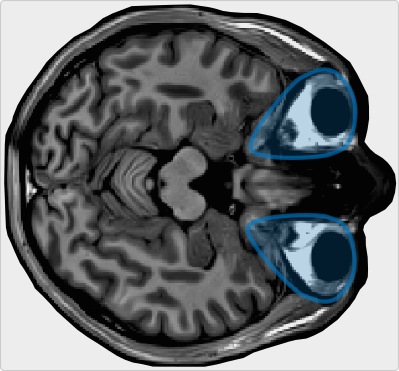

[](http://www.gnu.org/licenses/gpl-3.0)

[](https://doi.org/10.1038/s41593-021-00947-w)
[](https://github.com/DeepMReye/DeepMReye)

# MReyeXtract: eye-voxel extraction for fMRI


MReyeXtract extracts the eyeballs from 4D BOLD images so they can be fed to
[DeepMReye](https://github.com/DeepMReye/DeepMReye) or other gaze-decoding
models. Each run is registered to a DeepMReye eye template with
[ANTsPy](https://github.com/ANTsX/ANTsPy), cropped to the eye masks, and saved
alongside an interactive HTML quality-control report. It runs on
[BIDS](https://bids.neuroimaging.io/) datasets out of the box, and on arbitrary
directory trees via a glob pattern.

If you have questions or comments, please reach out (see [Correspondence](#correspondence)).

## Installation

MReyeXtract requires <u>**Python 3.11**</u>.

### Option 1: Pip install

#### Pip installation

```bash
python3.11 -m venv .venv
source .venv/bin/activate
pip install -e .
```

For development (tests, linting, type checking):

```bash
pip install -e ".[dev]"
```

#### Anaconda / Miniconda installation

```bash
conda create --name mreyextract python=3.11
conda activate mreyextract
pip install -e .
```

If ANTsPy does not resolve a wheel for your platform, install it manually first
(see the [ANTsPy installation guide](https://github.com/ANTsX/ANTsPy)) and then
re-run the install above.

## Usage

Installing the package exposes the `mreyextract` command-line tool. Run
`mreyextract --help` for the full list of options.

### BIDS datasets (default)

```bash
mreyextract --root /path/to/bids_dataset
```

To extract from a derivatives pipeline (e.g. fMRIPrep outputs):

```bash
mreyextract --root /path/to/bids_dataset --derivatives-dir fmriprep
```

Restrict which BOLD files are processed with BIDS entities. Each accepts one or
more values; `'*'` matches any value and `'none'`/`'null'` matches files where
the entity is absent:

```bash
mreyextract --root /path/to/bids_dataset \
            --subject 01 02 --task rest --run '*'
```

Filters can also be supplied as a JSON file via `--bids-filter-file` (the
BIDS-App convention). Precedence, lowest to highest, is: YAML config (see later) →
JSON BIDS filter file → explicit CLI entity flags, so the command line always
wins.

### Non-BIDS directories

Point `--no-bids-compatible` at any tree and provide a glob pattern:

```bash
mreyextract --root /path/to/data --no-bids-compatible \
            --glob-pattern 'sub-*/**/func/*_bold.nii*'
```

### Options

| Option | Description |
| --- | --- |
| `--root` | Root directory to search for BOLD files (required). |
| `--bids-compatible` / `--no-bids-compatible` | Treat `--root` as a BIDS dataset. Default: BIDS. |
| `--derivatives-dir` | Relative derivatives directory to extract from (e.g. `fmriprep`). |
| `--glob-pattern` | Glob for non-BIDS mode. Default: `sub-*/**/func/*_bold.nii*`. |
| `--force` | Overwrite existing outputs instead of skipping them. |
| `--as-pickle` | Save the masked eye voxels as a pickled array instead of NIfTI. |
| `--n-jobs` | Number of runs to process in parallel. `1` (default) is serial; `-1` uses all cores. |
| `--threads-per-job` | ITK/ANTs threads per parallel job. Default: `cores // n_jobs`. |
| `--log-level` | Logging verbosity: `DEBUG`, `INFO`, `WARNING`, `ERROR`. Default: `INFO`. |
| `--bids-filter-file` | Path to a JSON file of BIDS entity filters. |
| `--config` | Path to a YAML config file that seeds the options above. |

### Config file

Rather than passing many flags, the run can be described in a YAML file and
loaded with `--config`. Keys under `extract` mirror the CLI options (with
underscores); explicit flags on the command line override the file:

```yaml
# run.yaml
extract:
  root: /abs/path/to/bids_dataset
  derivatives_dir: fmriprep
  n_jobs: 4
  threads_per_job: 2
  filters:
    task: [rest]        # "*" -> any, "none"/"null" -> absent
```

```bash
mreyextract --config run.yaml            # everything from the file
mreyextract --config run.yaml --force    # override a single option
```

### Parallel processing

Runs are independent, so they can be processed in parallel across a
[loky](https://joblib.readthedocs.io/en/stable/parallel.html) process pool:

```bash
mreyextract --root /path/to/bids_dataset --n-jobs 8
```

Registration (ANTsPy/ITK) is itself multithreaded, so the tool splits the
available cores between across-run parallelism (`--n-jobs`) and each run's own
threads (`--threads-per-job`) to avoid oversubscription. By default
`threads-per-job` is set to `cores // n_jobs`, where `cores` respects the CPU
allocation (SLURM/cgroup affinity), not just the physical node — so the default
is safe when running interactively inside an allocation. Tune both together on a
shared server, and keep an eye on memory — each concurrent run holds a full 4D
BOLD volume in RAM.

### Python API

The extraction entry point can also be called directly:

```python
from mreyextract.extract import extract_eyeball_voxels

extract_eyeball_voxels(
    root="/path/to/bids_dataset",
    glob_pattern="sub-*/**/func/*_bold.nii*",
    bids_compatible=True,
    filters={"task": "rest"},
)
```

## Data formats

Inputs are 4D <u>**BOLD**</u> images in NIfTI format (`.nii` / `.nii.gz`).
Outputs are written to a BIDS-style derivatives folder under the dataset root:

```
<root>/derivatives/mreyextract/
    dataset_description.json
    sub-01/func/
        sub-01_task-rest_run-1_desc-eye_bold.nii.gz   # masked eye voxels
        sub-01_task-rest_run-1_desc-eye_report.html   # QC report
```

With `--as-pickle`, the eye voxels are saved as a pickled NumPy array
(`*_desc-eye_timeseries.p`) instead of NIfTI. Existing outputs are skipped
unless `--force` is passed.

## Hardware requirements

Registration is CPU-based and runs per BOLD run. A standard workstation is
sufficient; no GPU is required. Memory scales with image size — 4D BOLD runs are
held in memory during registration, so allow several GB of free RAM for
high-resolution or long acquisitions.

## Software requirements

MReyeXtract is developed and tested on Python 3.11. Core dependencies (installed
automatically):

```
numpy      (<2.0.0)
nibabel    (>=5.3.2)
antspyx    (>=0.6.1)
scipy      (>=1.15.1)
plotly     (>=6.5.0)
pybids     (>=0.22.0)
joblib     (>=1.3)
pyyaml     (>=6.0)
```

## Running on a cluster (SLURM)

The [`slurm/`](slurm) directory contains a ready-to-adapt job-array template
(`submit.sbatch`) and an example `config.yaml`. The pattern is **one array task
per subject**: SLURM provides the across-subject parallelism, and each task lets
ANTs use all of its allocated cores.

```bash
mkdir -p logs
sbatch slurm/submit.sbatch slurm/config.yaml
```

The template reads the subject list from the config's `slurm.subjects`, injects
the right subject per array index, and caps ITK/OpenMP threads to
`--cpus-per-task`. Edit the `#SBATCH` resource directives (and the `--array`
range to match the number of subjects), the `module load` line (must be a
**Python 3.11** build), and the virtual-environment path before submitting.

## Tests

```bash
pytest
```

## Development

MReyeXtract is maintained as part of the OpenMReye ecosystem and is a
dependency of other packages, so releases follow an automated, convention-based
pipeline. Please read this section before contributing.

### Local setup

```bash
python3.11 -m venv .venv
source .venv/bin/activate
pip install -e ".[dev]"
```

Run the full check suite (mirrors CI) before pushing:

```bash
./format_and_test.sh          # black, mypy, pylint, tests
```

### Branch and commit workflow

`main` is protected: no direct pushes. All changes land through pull requests
that are **squash-merged**, so **the PR title becomes the commit message on
`main`**. That title must be a valid
[Conventional Commit](https://www.conventionalcommits.org/), because it is what
drives the next version number:

| PR title prefix | Example | Release effect |
| --- | --- | --- |
| `fix:` | `fix: correct mask resampling origin` | patch (`0.1.0` → `0.1.1`) |
| `feat:` | `feat: add --as-pickle output` | minor (`0.1.0` → `0.2.0`) |
| `feat!:` / `BREAKING CHANGE:` | `feat!: drop Python 3.10 support` | major bump* |
| `docs:` / `chore:` / `ci:` / `test:` / `refactor:` | `docs: clarify SLURM template` | no release |

<sub>*While the package is in `0.x` (`allow_zero_version`, `major_on_zero =
false`), a breaking change bumps the **minor** version rather than jumping to
`1.0.0`. Graduating to `1.0.0` is a deliberate decision to make once the API is
stable, since downstream packages pin against these numbers.</sub>

The PR title is checked automatically (`pr-title.yml`); a malformed title blocks
the merge.

### How a release happens

The pipeline is fully automated and stores **no secrets** — you never bump a
version or publish by hand:

1. **`ci.yml`** runs the check suite on every PR. These are required status
   checks, so `main` is always green.
2. On merge to `main`, **`release.yml`** runs. Its first job uses
   [python-semantic-release](https://python-semantic-release.readthedocs.io/):
   it reads the Conventional Commits since the last release, and *if* there is
   something to release, creates the `vX.Y.Z` git tag and a GitHub Release
   (whose notes are the changelog). It is configured **not** to commit or push
   to `main`, so the branch is never touched and the default `GITHUB_TOKEN`
   suffices. The version lives only in git tags and is read at build time by
   `hatch-vcs`.
3. The workflow's second job then builds the sdist/wheel from that tag and
   uploads to [PyPI](https://pypi.org/p/mreyextract) via **Trusted Publishing**
   (OIDC — no PyPI token anywhere). It runs in the `pypi` deployment
   environment, so the upload waits on manual approval.

Pure `docs:`/`chore:` merges produce no release, so `main` does not spam PyPI.

## BIDS app

MReyeXtract reads and writes BIDS-compatible layouts: it queries BOLD files with
[PyBIDS](https://github.com/bids-standard/pybids), honours BIDS entity filters,
and emits a `derivatives/mreyextract/` folder with a `dataset_description.json`.

## Correspondence

If you have questions, comments or inquiries, please reach out to us:
zachnudels[at]gmail.com
